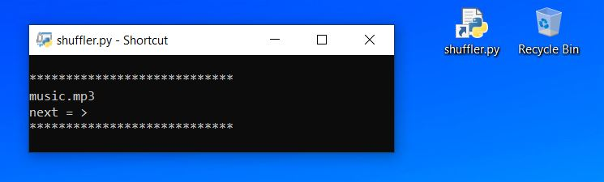

```diff
+ Shuffle Music
```
Just a simple project to randomly play a song based on your music folder location!its so usefull and handy for me!</br>
Just paste your musics folder location inside "my_musics_location" variable and done! thats all!</br>
Press enter for another shuffle!over and over again!

